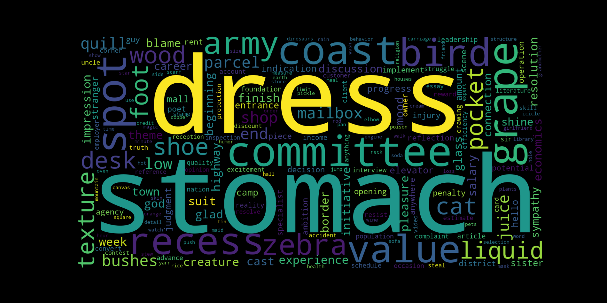

# Instagram-wordcloud
  Uses the category-data from Instagram privacy export and creates a wordcloud. It convertes the abstract Data from Instagram to a really nice and visual image. It shows what Instagram knows about you in an short an easy to understand way and is weighted with the fontsizes etc to shows you a part of the picture of your digital identity and hopefully helps to change the way you share your personal data and your use of social media.

## Requirements
 ##### Python 3 (tested with Python 3.9.7)
 No deeper knowledge, just install Python 3 and install the packages below by typing `pip3 \<package-name\>` in your Terminal
 
  #### Packages
    wordcloud, matplotlib, bs4

## Usage
  Download your data in html format from [Instagram](https://www.instagram.com/download/request/)
  After a few day you will recieve an Zip file.
  Unpack your Data export and copy '/information_about_you/ads_interests.html' into the project folder.
  Then start the python script with tiping 'python3 wordcloud.py' in you terminal.

  If you want to open an matplotlib instance instead of saving the file, you can change 'save' -> false.

## Examples

This is how the standart version will look like. 

##### Inspirations for more wordclouds on [datacamp.com](https://www.datacamp.com/community/tutorials/wordcloud-python)
