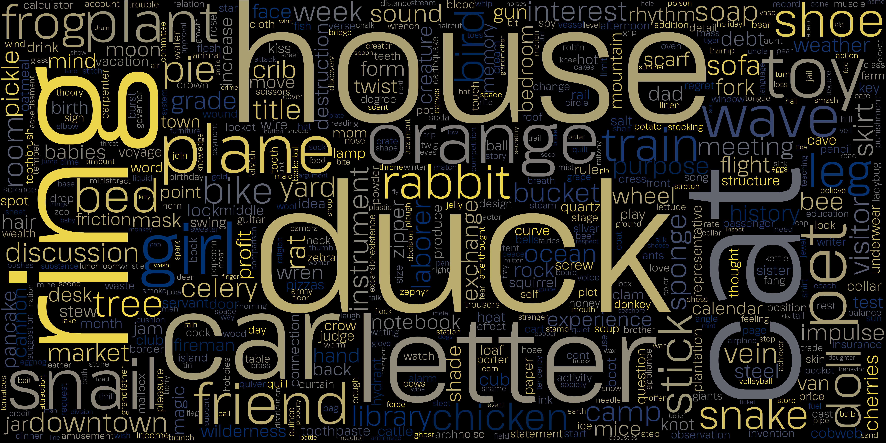

# Instagram-Wordcloud
  Uses the category-data from Instagram privacy export and creates a wordcloud. It convertes the abstract Data from Instagram to a really nice and visual image. It shows what Instagram knows about you in a short and easy to understand way and is weighted with the fontsizes etc to show you a part of the picture of your digital identity and hopefully helps to change the way you share your personal data and your use of social media.

# Installation
  ## Linux 
   + [wordcloud](https://github.com/amueller/word_cloud)
   + [matplotlib](https://github.com/matplotlib/matplotlib)
   + [bs4](https://beautiful-soup-4.readthedocs.io/en/latest/)
   + [pngquant](https://github.com/kornelski/pngquant)
   + [zopflipng](https://github.com/chrissimpkins/zopfli)
   
    sudo apt install git
    
   
    git clone https://github.com/pIlIp-d/Instagram-Wordcloud.git
    
    pip3 install wordcloud
    pip3 install matplotlib
    pip3 install bs4
    pip3 install pngquant
    pip3 install zopflipng
  ## Windows
  Windows can't compress the .png yet.
   + [Visual Studio C++ Build Tool](https://docs.microsoft.com/de-de/visualstudio/install/install-visual-studio?view=vs-2019)
   + [wordcloud](https://github.com/amueller/word_cloud)
   
   Open your Command Line (or Anaconda) and install wordcloud and bs4 through: 
   
    python3 -m pip install wordcloud
    python3 -m pip install bs4
    cd <package_path>\Instagram-Wordcloud
  
# Usage
  Download your data in html format from [Instagram](https://www.instagram.com/download/request/).
  After a few days you will recieve a Zip file. 
  Unpack your Data export and copy '/information_about_you/ads_interests.html' into the project folder.
  Then start the python script with tiping `python3 <path-to-project>/Instagram-Wordcloud.py` in you terminal.
  It will take a while. And when it finished you can safely open the file. If after a couple of minutes nothing changes try to press enter.
  
  #### Options in Instagram-wordcloud.py

  To change the density of the words change the `max_words` value.
  
  The colorscheme can be edited in the top. 
  
  To deaktivate compression change `compress` -> false.
  I edited crunch for compression.`crunch.py` [@chrissimpkins/Crunch](https://github.com/chrissimpkins/Crunch)
  
# Examples

This is how the standart version will look like. 
black - cividis

white - cool

black - vividis

(I used random words.)

##### Inspirations for more wordclouds on [datacamp.com](https://www.datacamp.com/community/tutorials/wordcloud-python)
